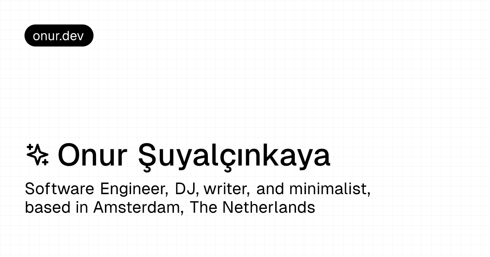

# glvr.dev



<br>
<br>

My personal website

## Overview

- `/` — Home page.
- `/[slug]` — Static pre-rendered pages using [Contentful](https://www.contentful.com). (e.g. `/stack`)
- `/writing` — Writing page.
- `/writing/[slug]` — Static pre-rendered writing pages using [Contentful](https://www.contentful.com).
- `/journey` — Journey page.
- `/workspace` — Workspace page.
- `/bookmarks` — Bookmarks page.
- `/bookmarks/[slug]` — Static pre-rendered bookmarks pages using [Raindrop](https://raindrop.io/).
- `/bookmarks.xml` — Bookmarks XML feed.
- `/api` — API routes.

## Running Locally

```bash
$ git clone https://github.com/gloverola/glvr.dev.git
$ cd glvr.dev
$ bun i
$ bun dev
```

## Tech Stack

- [Next.js](https://nextjs.org)
- [Tailwind CSS](https://tailwindcss.com)
- [shadcn/ui](https://ui.shadcn.com)
- [Contentful](https://www.contentful.com)
- [Raindrop](https://raindrop.io)
- [Supabase](https://supabase.com)
- [Vercel](https://vercel.com)
